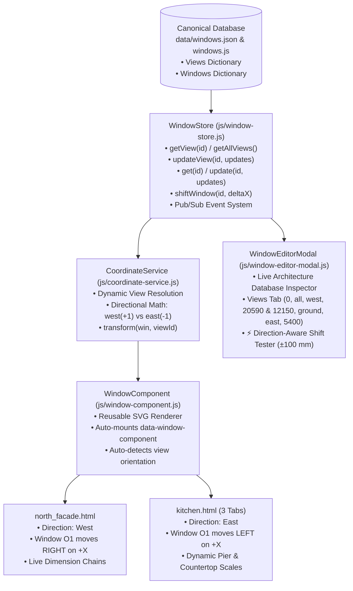

# Building Component Architecture: Multi-View Spatial Orientation & Dynamic Window Database

## 1. Executive Summary & Problem Formulation

In architectural documentation and interior visualization for the house, multiple distinct views represent the same structural elements from opposing or different vantage points:
- **Exterior North Facade ([north_facade.html](file:///Users/dhans/jetski_workshop/north_facade.html))**: Shows the whole building exterior looking **South** from the garden.
- **Interior Kitchen North Wall ([kitchen.html](file:///Users/dhans/jetski_workshop/kitchen.html))**: Shows the kitchen cabinetry, counter, and sink looking **North** towards the garden.

### The Problem
The kitchen's back wall is literally **the other side of the north facade wall**. Window **O1** in the kitchen is the identical physical opening as window **O1** on the North Facade. Previously:
1. Coordinates, widths, and sills were hardcoded independently in every page.
2. Changing Window O1 required tedious, error-prone manual edits across multiple HTML files and SVG view tabs.
3. Crucially, coordinate orientation between the exterior (looking South) and interior (looking North) was inverted, creating severe cognitive friction when determining whether an object should move left or right when modified.

### The Solution
We have decomposed the architecture into:
1. **First-Class View Entities** in the database (`data/windows.json` and `data/windows.js`), storing each view's global map datum, floor level, orientation direction (`west`, `east`, `north`, `south`), and length.
2. **First-Class Window Entities**, storing canonical geometric properties in a universal building reference frame.
3. **Direction-Aware Coordinate Engine (`CoordinateService`)**, mathematically calculating screen positions and proving directional shift behavior ($\Delta X$).
4. **Reactive Store Layer (`WindowStore`)**, supporting pub/sub live updates, multi-tab synchronization, and single-call directional shifting (`shiftWindow(id, deltaX)`).

---

## 2. Global Coordinate Frame of Reference

All architectural elements and views are anchored to a universal building coordinate system:

```
                      [ NORTH (Garden) ]
                            ▲
                            │
  WEST (Axis 1: Garage)     │     EAST (Axis 6: Gabinet)
  ◄─────────────────────────┼─────────────────────────►
  X = 20,590 mm             │             X = 0 mm (Global Origin)
                            │
                            ▼
                      [ SOUTH (Interior) ]
```

| Axis | Origin Datum | Positive Direction | Architectural Definition |
| :--- | :--- | :--- | :--- |
| **Global X** | Eastmost corner of the building ($X = 0\,\text{mm}$) | Westward ($0 \to 20\,590\,\text{mm}$) | Baseline along the North Facade from East to West. |
| **Global Y** | Finished Ground Floor ($+0.00\,\text{m} = 0\,\text{mm}$) | Upward | Elevation height above finished ground level. |
| **Global Z** | Exterior North Facade plane ($Z = 0\,\text{mm}$) | Southward into the house | Wall thickness and room depth. |

---

## 3. View Data Model Specification

Each view is stored as an entry in `data/windows.json` and `data/windows.js` under `"views"`. Every view records 4 mandatory properties:

1. **`positionOnMap` / `leftEdge`** *(number, mm)*: Global map coordinate of the view's left edge on screen.
2. **`floor`** *(string)*: Floor level (`"ground"`, `"first"`, or `"all"`).
3. **`direction`** *(string)*: Horizontal orientation direction (`"west"`, `"east"`, `"north"`, or `"south"`). Indicates in which compass direction coordinate values progress from left to right across the view.
4. **`length`** *(number, mm)*: Total length of the wall or elevation view.

### Canonical Views Configuration

```json
{
  "views": {
    "north_facade": {
      "id": "north_facade",
      "name": "North Facade Elevation",
      "positionOnMap": 0,
      "leftEdge": 0,
      "floor": "all",
      "direction": "west",
      "length": 20590,
      "scale": 0.1,
      "wall": "north",
      "side": "exterior"
    },
    "kitchen_north_wall": {
      "id": "kitchen_north_wall",
      "name": "Kitchen North Wall Elevation",
      "positionOnMap": 12150,
      "leftEdge": 12150,
      "floor": "ground",
      "direction": "east",
      "length": 5400,
      "scale": 0.1,
      "wall": "north",
      "side": "interior"
    }
  }
}
```

---

## 4. Window Data Model Specification

Every window entity records the 6 core properties requested by the architectural specification:

```json
{
  "windows": {
    "O1": {
      "id": "O1",
      "name": "O1",
      "x": 8750,
      "sill": 1100,
      "width": 2500,
      "height": 1400,
      "room": "0.13 Kuchnia",
      "floor": "ground",
      "wall": "north",
      "views": ["north_facade", "kitchen_north_wall"]
    },
    "O2": {
      "id": "O2",
      "name": "O2",
      "x": 1150,
      "sill": 800,
      "width": 1800,
      "height": 1700,
      "room": "0.15 Gabinet",
      "floor": "ground",
      "wall": "north",
      "views": ["north_facade"]
    }
  }
}
```

### The 6 Core Properties:
1. **`x`** *(number, mm)*: Horizontal coordinate of the opening's lower-left corner from the Eastmost origin ($X = 0$).  
   *For O1*: **`8750`** mm; *For O2*: **`1150`** mm ($(77+38) = 1150$ mm from left corner).
2. **`sill`** *(number, mm)*: Height of windowsill above finished floor level ($hp$).  
   *For O1*: **`1100`** mm; *For O2*: **`800`** mm.
3. **`width`** *(number, mm)*: Horizontal opening width.  
   *For O1*: **`2500`** mm; *For O2*: **`1800`** mm (formerly 1200 mm).
4. **`height`** *(number, mm)*: Vertical opening height.  
   *For O1*: **`1400`** mm; *For O2*: **`1700`** mm.
5. **`id`** *(string)*: Unique identifier.  
   *For O1*: **`"O1"`**; *For O2*: **`"O2"`**.
6. **`name`** *(string)*: Display name / architectural mark.  
   *For O1*: **`"O1"`**; *For O2*: **`"O2"`**.

### Ground Floor North Facade Elevation Chain Verification:
$$\text{Corner to O2 } (1\,150\,\text{mm}) + \mathbf{O2 } (1\,800\,\text{mm}) + \text{Pier O2}\to\text{O1 } (5\,800\,\text{mm}) + \mathbf{O1 } (2\,500\,\text{mm}) + \text{Pier to Garage } (760\,\text{mm}) + \text{Garage } (\mathbf{8\,580\,\text{mm}}) = \mathbf{20\,590\,\text{mm}}$$

### Upper Floor North Facade Elevation Chain Verification:
Based on official architectural drawing *A.03 RZUT PIĘTRA*:
$$\begin{aligned}
&\text{Balcony } (6\,400\,\text{mm}) + \mathbf{14a } (\mathbf{1\,190\,\text{mm}}) + \text{Pier 1 } (\mathbf{1\,170\,\text{mm}}) + \mathbf{O11\_1 } (1\,000\,\text{mm}) \\
&+ \text{Pier 2 } (\mathbf{1\,700\,\text{mm}}) + \mathbf{O11\_2 } (1\,000\,\text{mm}) + \text{Pier 3 } (\mathbf{1\,640\,\text{mm}}) + \mathbf{O11\_3 } (1\,000\,\text{mm}) \\
&+ \text{Pier 4 } (\mathbf{3\,110\,\text{mm}}) + \mathbf{O13a } (\mathbf{2\,380\,\text{mm}}) = \mathbf{20\,590\,\text{mm}}
\end{aligned}$$

| Element | Start $X$ (mm) | End $X$ (mm) | Width (mm) | Description / Room |
| :--- | :--- | :--- | :--- | :--- |
| **Balcony** | 0 | 6 400 | 6 400 | Cantilevered terrace over Gabinet |
| **Window 14a** | 6 400 | 7 590 | **1 190** | Bedroom 1.04 full-height glazing |
| *Pier 1* | 7 590 | 8 760 | **1 170** | Wall pier between 14a and O11_1 |
| **Window O11_1** | 8 760 | 9 760 | 1 000 | Bathroom 1.03 vertical slot window |
| *Pier 2* | 9 760 | 11 460 | **1 700** | Wall pier between O11_1 and O11_2 |
| **Window O11_2** | 11 460 | 12 460 | 1 000 | Bathroom 1.02 vertical slot window |
| *Pier 3* | 12 460 | 14 100 | **1 640** | Wall pier between O11_2 and O11_3 |
| **Window O11_3** | 14 100 | 15 100 | 1 000 | Hall / Bedroom corridor daylight window |
| *Pier 4* | 15 100 | 18 210 | **3 110** | Wall pier between O11_3 and O13a |
| **Window O13a** | 18 210 | 20 590 | **2 380** | Master Bedroom 1.01 corner window extending to exterior West corner |

---

## 5. Mathematical Proof of Directional Shifting

When shifting an object (like window O1) by increasing global $X$ by $+100\,\text{mm}$ ($\Delta X = +100$), how does the object move on each view?

### Case A: North Facade Elevation (`north_facade`)
- **Observer**: Standing in northern garden, looking **South** towards the building.
- **Direction**: **`west`**.
- **Left Edge on Map**: $X_{\text{left}} = 0\,\text{mm}$.
- Coordinate values **grow Westward** from left to right:
  $$\text{screenX}_{\text{mm}} = X - X_{\text{left}} = X - 0 = X$$
  For Window O1 ($X = 8750\,\text{mm}$):
  $$\text{screenX}_{\text{mm}} = 8750\,\text{mm} \quad (\text{SVG } x = 875.0)$$
- When $X$ increases by $\Delta X = +100\,\text{mm}$:
  $$\text{screenX}_{\text{mm}}' = (X + 100) - 0 = \text{screenX}_{\text{mm}} + 100$$
- $\Delta \text{screenX} = +100\,\text{mm} > 0 \implies$ The object moves to the **RIGHT** on screen.

### Case B: Kitchen North Wall Elevation (`kitchen_north_wall`)
- **Observer**: Standing inside the kitchen, looking **North** towards the garden.
- **Direction**: **`east`**.
- **Left Edge on Map**: $X_{\text{left}} = 12150\,\text{mm}$.
- **Fridge Position**: Starts at $X_{\text{screen}} = 3600\,\text{mm}$ ($x = 360.0$).
- **Positioning Requirement**: Right edge of Window O1 must be **$200\,\text{mm}$ from the fridge**:
  $$\text{screenX}_{\text{right}} = 3600 - 200 = 3400\,\text{mm}$$
  $$\text{screenX}_{\text{left}} = 3400 - 1950 = 1450\,\text{mm} \quad (\text{SVG } x = 145.0)$$
- Coordinate values **decrease Eastward** from left to right:
  $$\text{screenX}_{\text{left}} = X_{\text{left}} - (X + W)$$
  $$1450 = 12150 - (X + 1950) \implies X = \mathbf{8750\,\text{mm}}$$
- When $X$ increases by $\Delta X = +100\,\text{mm}$ ($X' = 8850\,\text{mm}$):
  $$\text{screenX}_{\text{left}}' = 12150 - (8850 + 1950) = 1350\,\text{mm} \quad (\text{SVG } x = 135.0)$$
- $\Delta \text{screenX} = -100\,\text{mm} < 0 \implies$ The object moves to the **LEFT** on screen.

### Summary Comparison Matrix

| Elevation View | View Direction | Left Edge ($X_{\text{left}}$) | Screen Offset Formula | Shift with $+100\,\text{mm}$ ($\Delta X > 0$) | Shift with $-100\,\text{mm}$ ($\Delta X < 0$) |
| :--- | :--- | :--- | :--- | :--- | :--- |
| **North Facade** | **`west`** | $0\,\text{mm}$ | $x = X - 0$ | Moves **RIGHT** ($+100\,\text{mm}$) | Moves **LEFT** ($-100\,\text{mm}$) |
| **Kitchen North Wall** | **`east`** | $12150\,\text{mm}$ | $x = 12150 - (X + W)$ | Moves **LEFT** ($-100\,\text{mm}$) | Moves **RIGHT** ($+100\,\text{mm}$) |

---

## 6. System Architecture & Component Interactions



---

## 7. Developer & User Guide

### 1. Interactive Live Inspection & Shift Testing in the Browser
1. Open [north_facade.html](file:///Users/dhans/jetski_workshop/north_facade.html) or [kitchen.html](file:///Users/dhans/jetski_workshop/kitchen.html) in any modern browser.
2. Click the floating **"🪟 Architecture Database (Live)"** badge at the bottom-right (or click Window O1 directly).
3. In the modal:
   - Switch between **"Window Openings"** and **"Architectural Views"** to inspect view parameters.
   - Click **"◀ Shift -100 mm"** or **"Shift +100 mm ▶"** in the **Direction-Aware Shift Tester**.
   - Watch the live readout:
     ```
     • North Facade (dir: west): +ΔX shifts RIGHT (Screen X = 8550 mm)
     • Kitchen North Wall (dir: east): +ΔX shifts LEFT (Screen X = 1700 mm)
     ```
   - Observe both the elevation drawing and dimension chains shifting simultaneously and opposite to each other.

### 2. Programmatic API Usage
```javascript
// Shift Window O1 Westward by 100mm
WindowStore.shiftWindow('O1', 100);

// Inspect shift behavior for any view
const shiftInfo = CoordinateService.getShiftDirection('kitchen_north_wall');
console.log(shiftInfo.label); // "LEFT"

// Transform coordinates dynamically
const coords = CoordinateService.transform(WindowStore.get('O1'), 'kitchen_north_wall');
console.log(coords.localX_mm); // 1700 mm (or 1800 mm at default position)
```

---

## 8. Verified File Manifest

- [data/windows.json](file:///Users/dhans/jetski_workshop/data/windows.json): Canonical JSON database with `"views"` (`north_facade` and `kitchen_north_wall`) and `"windows"`.
- [data/windows.js](file:///Users/dhans/jetski_workshop/data/windows.js): Universal Module Definition loader compatible with Node.js and local `file://` protocol.
- [js/coordinate-service.js](file:///Users/dhans/jetski_workshop/js/coordinate-service.js): Direction-aware coordinate projection engine.
- [js/window-store.js](file:///Users/dhans/jetski_workshop/js/window-store.js): Reactive store with view management, window updates, and `shiftWindow(id, deltaX)`.
- [js/window-component.js](file:///Users/dhans/jetski_workshop/js/window-component.js): Reusable SVG component supporting exterior and interior kitchen elevation modes.
- [js/window-editor-modal.js](file:///Users/dhans/jetski_workshop/js/window-editor-modal.js): Live inspector modal with Views tab and real-time Shift Tester.
- [kitchen.html](file:///Users/dhans/jetski_workshop/kitchen.html): Kitchen elevations with `data-view-id="kitchen_north_wall"` and responsive dimension chains.
- [north_facade.html](file:///Users/dhans/jetski_workshop/north_facade.html): North facade elevation with dynamic O1/O2 component rendering and live dimension chains.
